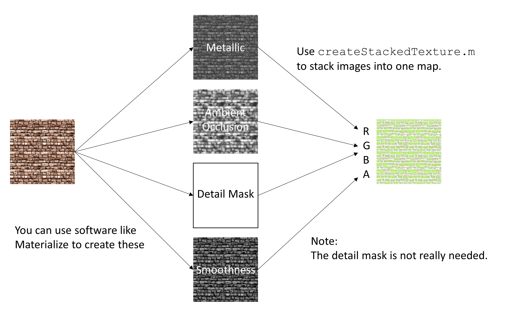

So, I recently tried to create a stacked texture map so I can used it in Unity to create better materials (see for [details](https://docs.unity3d.com/Packages/com.unity.render-pipelines.high-definition@7.1/manual/Mask-Map-and-Detail-Map.html)).  

This function does nothing else then loading a bunch of grayscale images and stacks it into the RGBA channels of one file. 

Texture downloaded from https://opengameart.org/node/7506 and edited with http://boundingboxsoftware.com/materialize/index.php